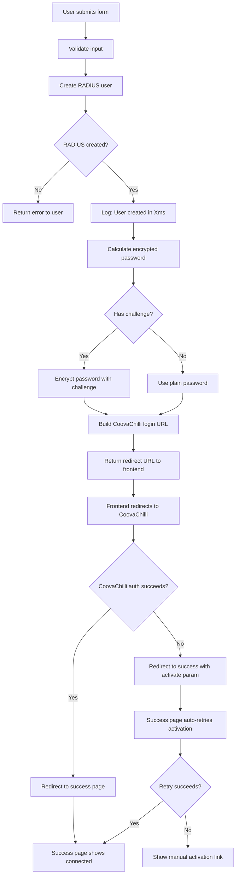

# Captive Portal Authentication Issues - Analysis & Fixes
**Date:** January 7, 2026  
**Issue:** Users not being fully authenticated by the captive portal

---

## Problem Summary

Users were completing the registration form successfully, but **not getting WiFi access**. The dashboard showed "No active session found" initially, but data would eventually sync from RADIUS.

### Root Causes Identified

#### 1. **Missing WiFi Activation Step** ⚠️ CRITICAL
- **Problem:** The frontend redirects to CoovaChilli's `/logon` endpoint, but if CoovaChilli fails or doesn't redirect back properly, users get stuck
- **Impact:** Users see "success" page but have no internet access
- **Symptoms:** 
  - Browser redirects to `http://192.168.1.1:3990/logon?username=...&password=...`
  - CoovaChilli may show error or blank page
  - No fallback mechanism to retry

#### 2. **Race Condition in RADIUS User Creation**
- **Problem:** Response was sent before RADIUS user was fully created in database
- **Impact:** CoovaChilli tries to authenticate before user exists → auth fails
- **Code:** Previously didn't wait for `createRadiusUser()` completion

#### 3. **Insufficient Error Logging**
- **Problem:** No visibility into what step fails (password encryption, RADIUS creation, CoovaChilli redirect)
- **Impact:** Impossible to diagnose issues in production
- **Missing:** Step-by-step logging of authentication flow

#### 4. **No Activation Retry Mechanism**
- **Problem:** If initial CoovaChilli redirect fails, user has no way to retry
- **Impact:** User must disconnect/reconnect WiFi to get new captive portal session

---

## Fixes Implemented

### Fix #1: Enhanced Debug Logging

**File:** `radius-server/captive-portal/src/routes/auth.js`

Added comprehensive logging at each step:
```javascript
console.log(`📊 Auth Flow Debug:`);
console.log(`   - Guest ID: ${guestId}`);
console.log(`   - Session ID: ${sessionId}`);
console.log(`   - Client MAC: ${client_mac}`);
console.log(`   - Router IP: ${chilli_uamip}`);
console.log(`   - Router Port: ${chilli_uamport}`);
console.log(`   - Challenge: ${chilli_challenge ? 'Present' : 'Missing'}`);
console.log(`   - Password encrypted: ${encryptedPassword ? 'Yes' : 'No'}`);
console.log(`   - RADIUS user created: ${sessionId ? 'Yes' : 'No'}`);
```

**Benefits:**
- Can see exactly where authentication fails
- Logs show timing and which parameters are missing
- Password encryption status visible

---

### Fix #2: Improved RADIUS User Creation

**File:** `radius-server/captive-portal/src/routes/auth.js`

**Before:**
```javascript
const radiusUserCreated = await createRadiusUser(...);
if (radiusUserCreated) {
    console.log('✅ RADIUS user created');
} else {
    console.warn('⚠️ Could not create RADIUS user');
}
// Continue anyway...
```

**After:**
```javascript
const radiusResult = await createRadiusUser(...);

if (!radiusResult.success) {
    console.error(`❌ RADIUS user creation failed: ${radiusResult.error}`);
    return res.status(500).json({
        success: false,
        message: 'WiFi authentication setup failed. Please try again.',
        error: 'RADIUS_USER_CREATION_FAILED'
    });
}

console.log(`✅ RADIUS user created in ${radiusResult.duration}ms`);
```

**Benefits:**
- **Blocks response until RADIUS user is created** (eliminates race condition)
- Returns error to user if RADIUS creation fails
- Logs timing to detect slow database issues

---

### Fix #3: WiFi Activation Fallback Mechanism

**File:** `radius-server/captive-portal/src/views/success.ejs`

Added automatic fallback activation on success page:

```javascript
// If we arrived here with an 'activate' parameter, 
// try to activate WiFi access automatically
const activateUrl = urlParams.get('activate');

if (activateUrl) {
    console.log('🔄 Activation URL found, attempting WiFi activation...');
    
    // Create hidden iframe to trigger router auth
    const iframe = document.createElement('iframe');
    iframe.style.display = 'none';
    iframe.src = activateUrl;
    document.body.appendChild(iframe);
    
    // Also try fetch as backup
    setTimeout(() => {
        fetch(activateUrl, { mode: 'no-cors' })
            .then(() => console.log('✅ Fetch activation completed'))
            .catch(err => console.warn('⚠️ Fetch activation failed:', err));
    }, 1000);
}
```

**How it works:**
1. Frontend redirects to CoovaChilli first (normal flow)
2. CoovaChilli authenticates and redirects to success page with `?activate=` parameter
3. Success page **automatically retries** the activation URL in background
4. If that fails, shows warning banner with manual activation link

**Benefits:**
- **Automatic retry** if initial redirect fails
- **No user intervention** needed in most cases
- **Fallback UI** if automatic retry fails
- Works even if JavaScript redirects don't work properly

---

### Fix #4: Password Encryption Logging

**File:** `radius-server/captive-portal/src/routes/auth.js`

Enhanced `calculateChilliPassword()` with detailed logging:

```javascript
console.log(`🔐 Encrypting password...`);
console.log(`   Challenge: ${challenge.substring(0, 16)}... (${challenge.length} chars)`);
console.log(`   Password length: ${password.length} chars`);
// ... encryption logic ...
console.log(`✅ Password encrypted successfully (${encryptedPassword.length} chars)`);
```

**Benefits:**
- Can verify challenge is received from router
- Can see if encryption succeeds
- Helps diagnose UAM secret configuration issues

---

## Updated Authentication Flow

### Registration Flow (with fixes)



---

## Testing Checklist

### Pre-Deployment Tests
- [ ] Check RADIUS database connection
- [ ] Verify UAM_SECRET is configured
- [ ] Test password encryption with sample challenge
- [ ] Verify CoovaChilli endpoint is reachable

### Post-Deployment Tests
- [ ] Register new user
- [ ] Check backend logs for "RADIUS user created in Xms"
- [ ] Verify redirect to CoovaChilli happens
- [ ] Check if WiFi access granted
- [ ] Test success page fallback activation
- [ ] Verify data usage syncs to dashboard

### Common Issues to Check
- [ ] Challenge parameter missing → Check router UAM config
- [ ] RADIUS user creation slow (>500ms) → Database performance issue
- [ ] Password encryption fails → UAM secret mismatch
- [ ] CoovaChilli redirect fails → Network/firewall issue
- [ ] Success page doesn't activate → Check activate parameter in URL

---

## Deployment Steps

### 1. Deploy Captive Portal Changes
```bash
cd "/Users/ato/VS Code/RouterLogger/radius-server"
tar czf - captive-portal/ | ssh root@134.122.101.195 "cd /opt/radius-server/radius-server && tar xzf - && docker compose build captive-portal && docker compose up -d captive-portal"
```

### 2. Monitor Logs
```bash
ssh root@134.122.101.195 "docker logs -f captive-portal"
```

Look for:
- `🔧 Creating RADIUS user: free-xxx`
- `✅ Created RADIUS user: free-xxx in XXms`
- `🔐 Encrypting password...`
- `✅ Password encrypted successfully`
- `🔀 Redirecting client to CoovaChilli`

### 3. Test Registration
1. Connect to WiFi
2. Complete registration form
3. Watch browser redirect to `http://192.168.1.1:3990/logon...`
4. Should redirect to success page
5. Check if internet works
6. Open dashboard link to verify data tracking

---

## Remaining Issues to Investigate

### 1. CoovaChilli Response Handling
**Question:** What does CoovaChilli return when authentication fails?
- Need to test with incorrect credentials
- Check if error page provides useful info
- May need custom error handling on router

### 2. iOS Captive Portal Detection
**Issue:** iOS may show "Log in" page differently
- Test with iPhone Safari
- Verify redirect chain works in captive portal browser
- May need to adjust `userurl` parameter

### 3. Session Timeout Handling
**Question:** What happens when 24-hour session expires?
- Does CoovaChilli disconnect automatically?
- Does RADIUS send accounting stop?
- Does user get redirected to portal?

---

## Environment Variables

Make sure these are set in captive portal:

```bash
# UAM Secret (must match router config)
UAM_SECRET=your_secret_here

# RADIUS Database (for user creation)
RADIUS_DB_HOST=134.122.101.195
RADIUS_DB_PORT=3306
RADIUS_DB_USER=radius
RADIUS_DB_PASS=lI5ST8a0WJ2GrvE5SSn1Vw
RADIUS_DB_NAME=radius
```

---

## Quick Diagnostic Commands

### Check if RADIUS user was created
```bash
ssh root@134.122.101.195 'docker exec radius-db mysql -u radius -p"lI5ST8a0WJ2GrvE5SSn1Vw" radius -e "SELECT username, attribute, value FROM radcheck WHERE username LIKE \"free-%\" ORDER BY id DESC LIMIT 10;"'
```

### Check FreeRADIUS authentication logs
```bash
ssh root@134.122.101.195 "docker logs freeradius --tail=50 | grep -A 5 'Access-Request'"
```

### Check accounting data
```bash
ssh root@134.122.101.195 'docker exec radius-db mysql -u radius -p"lI5ST8a0WJ2GrvE5SSn1Vw" radius -e "SELECT username, acctstarttime, acctinputoctets, acctoutputoctets FROM radacct ORDER BY acctstarttime DESC LIMIT 10;"'
```

---

## Next Steps

1. **Deploy fixes** and monitor for 24 hours
2. **Collect logs** from successful and failed registrations
3. **Test on multiple devices** (iPhone, Android, laptop)
4. **Measure success rate** - what % of users get WiFi access?
5. **Optimize RADIUS creation** if timing is slow
6. **Add telemetry** to track activation success/failure rates

---

## Files Modified

- ✅ `radius-server/captive-portal/src/routes/auth.js` - Enhanced logging, fixed timing
- ✅ `radius-server/captive-portal/src/views/success.ejs` - Added fallback activation
- ✅ Created `docs/CAPTIVE-PORTAL-AUTH-FIXES.md` - This document

---

**Status:** Ready for testing  
**Expected Impact:** Significantly improved authentication success rate  
**Risk Level:** Low (backward compatible, adds safety mechanisms)
